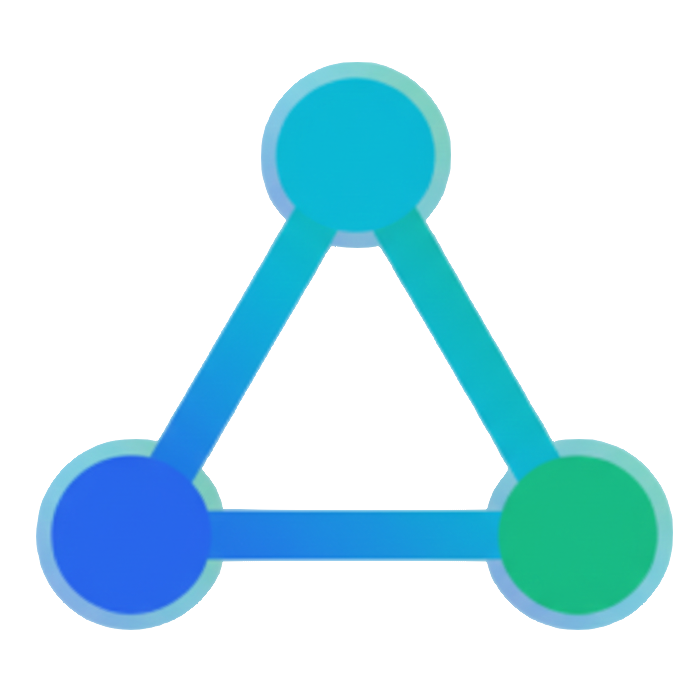
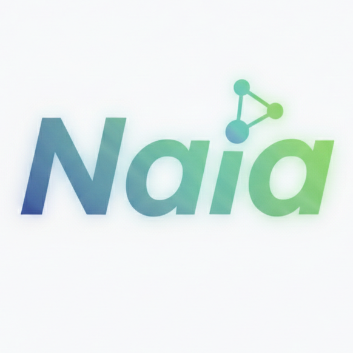

[English](../README.md) | [한국어](README.ko.md) | [日本語](README.ja.md) | [中文](README.zh.md) | [Français](README.fr.md) | [Deutsch](README.de.md) | [Русский](README.ru.md) | [Español](README.es.md) | [Português](README.pt.md) | [Tiếng Việt](README.vi.md) | [Bahasa Indonesia](README.id.md) | [العربية](README.ar.md) | [हिन्दी](README.hi.md) | [বাংলা](README.bn.md)

# Naia

<p align="center">
  
</p>

<p align="center">
  <picture>
    <source media="(prefers-color-scheme: dark)" srcset="../assets/logos/naia-dark-text-logo.png" />
    <source media="(prefers-color-scheme: light)" srcset="../assets/logos/naia-light-text-logo.png" />
    
  </picture>
</p>

<p align="center">
  
</p>

**The Next Generation AI OS** — Um sistema operacional de IA pessoal onde a sua propria IA vive

[](../LICENSE)

> "Codigo aberto. Sua IA, suas regras. Escolha sua IA, molde sua memoria e personalidade, de a ela sua voz — tudo na sua propria maquina, tudo verificavel no codigo."

> **Nota:** As amostras de avatares VRM exibidas sao do [VRoid Hub](https://hub.vroid.com/). O VRM oficial do mascote Naia esta em desenvolvimento.

## Conheca Naia

<p align="center">
  
  &nbsp;&nbsp;&nbsp;&nbsp;
  
</p>

<p align="center">
  <em>Padrao (sem genero) &nbsp;·&nbsp; Com cabelo (variante feminina)</em>
</p>

<details>
<summary>Mais variacoes do personagem</summary>
<p align="center">
  
</p>
</details>

## O que e o Naia?

Naia e um SO de IA pessoal que da aos individuos soberania total sobre sua IA. Escolha qual IA usar (incluindo modelos locais), configure sua memoria e personalidade localmente, personalize seu avatar 3D e voz — tudo permanece na sua maquina, sob seu controle.

Isto nao e apenas mais uma ferramenta de IA. E um sistema operacional onde sua IA vive, cresce e trabalha ao seu lado. Hoje e um SO desktop com um avatar 3D. Amanha — avatares de video em tempo real, cantar, jogar, e eventualmente seu proprio Physical AI (SO para androide).

### Filosofia central

- **Soberania de IA** — Voce escolhe sua IA. Nuvem ou local. O SO nao dita.
- **Controle completo** — Memoria, personalidade, configuracoes — tudo armazenado localmente. Sem dependencia da nuvem.
- **Sua propria IA** — Personalize avatar, voz, nome, personalidade. Torne-a verdadeiramente sua.
- **Sempre ativa** — A IA roda 24/7 em segundo plano, recebendo mensagens e trabalhando mesmo quando voce nao esta.
- **Codigo aberto** — Apache 2.0. Inspecione como a IA lida com seus dados. Modifique, personalize, contribua.
- **Visao de futuro** — Avatares VRM 3D → avatares de video em tempo real → cantar e jogar juntos → Physical AI

### Funcionalidades

- **Avatar 3D** — Personagem VRM com expressoes de emocoes (alegria/tristeza/surpresa/reflexao) e sincronizacao labial
- **Liberdade de IA** — 7 provedores em nuvem (Gemini, Claude, GPT, Grok, zAI) + IA local (Ollama) + Claude Code CLI
- **Local primeiro** — Memoria, personalidade, todas as configuracoes armazenadas na sua maquina
- **Execucao de ferramentas** — 8 ferramentas: leitura/escrita de arquivos, terminal, busca web, navegador, sub-agente
- **70+ habilidades** — 7 integradas + 63 personalizadas + 5.700+ habilidades da comunidade ClawHub
- **Voz** — 5 provedores TTS + STT + sincronizacao labial. De a sua IA a voz que voce quiser.
- **14 idiomas** — Coreano, ingles, japones, chines, frances, alemao, russo e mais
- **Sempre ligado** — O daemon OpenClaw Gateway mantém sua IA funcionando em segundo plano
- **Integracao de canais** — Converse com sua IA via Discord DM, a qualquer momento, de qualquer lugar
- **Seguranca de 4 niveis** — T0 (leitura) a T3 (perigoso), aprovacao por ferramenta, logs de auditoria
- **Personalizacao** — Nome, personalidade, estilo de fala, avatar, tema (8 tipos)

## Por que Naia?

Outras ferramentas de IA sao apenas "ferramentas". Naia e **"a sua propria IA"**.

| | Outras ferramentas de IA | Naia |
|---|--------------------------|------|
| **Filosofia** | Usar IA como ferramenta | Dar a IA o SO. Viver juntos. |
| **Publico** | Apenas desenvolvedores | Todos que querem sua propria IA |
| **Escolha de IA** | A plataforma decide | 7 nuvem + IA local — voce decide |
| **Dados** | Presos na nuvem | Memoria, personalidade, configuracoes tudo local |
| **Avatar** | Nenhum | Personagem VRM 3D + emocoes + sincronizacao labial |
| **Voz** | Apenas texto ou TTS basico | 5 TTS + STT + a voz propria da sua IA |
| **Implantacao** | npm / brew / pip | App de desktop ou SO em USB inicializavel |
| **Plataforma** | macOS / CLI / Web | Desktop Linux nativo → futuro: Physical AI |
| **Custo** | Chaves API separadas necessarias | Creditos gratis para comecar, IA local completamente gratis |

## Relacao com OpenClaw

Naia e construido sobre o ecossistema [OpenClaw](https://github.com/openclaw-ai/openclaw), mas e um produto fundamentalmente diferente.

| | OpenClaw | Naia |
|---|---------|---------|
| **Forma** | Daemon CLI + terminal | App de desktop + avatar 3D |
| **Publico** | Desenvolvedores | Todos |
| **UI** | Nenhuma (terminal) | App nativo Tauri 2 (React + Three.js) |
| **Avatar** | Nenhum | Personagem VRM 3D (emocoes, sincronizacao labial, olhar) |
| **LLM** | Provedor unico | Multi-provedor 7 + troca em tempo real |
| **Voz** | TTS 3 (Edge, OpenAI, ElevenLabs) | TTS 5 (+Google, Nextain) + STT + sincronizacao labial do avatar |
| **Emocoes** | Nenhuma | 6 emocoes mapeadas para expressoes faciais |
| **Onboarding** | CUI | GUI + selecao de avatar VRM |
| **Rastreamento de custos** | Nenhum | Painel de creditos em tempo real |
| **Distribuicao** | npm install | Flatpak / AppImage / DEB / RPM + imagem de SO |
| **Multilingue** | CLI em ingles | GUI de 14 idiomas |
| **Canais** | Bot de servidor (multicanal) | Bot de Discord DM dedicado ao Naia |

**O que pegamos do OpenClaw:** Arquitetura de daemon, motor de execucao de ferramentas, sistema de canais, ecossistema de habilidades (compativel com 5.700+ habilidades Clawhub)

**O que Naia construiu novo:** Tauri Shell, sistema de avatar VRM, agente multi-LLM, motor de emocoes, integracao TTS/STT, assistente de onboarding, rastreamento de custos, integracao de conta Nextain, sistema de memoria (STM/LTM), camadas de seguranca

## Arquitetura

```
┌──────────────────────────────────────────────────┐
│  Naia Shell (Tauri 2 + React + Three.js)         │
│  Chat · Avatar · Skills · Channels · Settings    │
│  State: Zustand │ DB: SQLite │ Auth: OAuth        │
└──────────────┬───────────────────────────────────┘
               │ stdio JSON lines
┌──────────────▼───────────────────────────────────┐
│  Naia Agent (Node.js + TypeScript)               │
│  LLM: Gemini, Claude, GPT, Grok, zAI, Ollama    │
│  TTS: Nextain, Edge, Google, OpenAI, ElevenLabs  │
│  Skills: 7 built-in + 63 custom                  │
└──────────────┬───────────────────────────────────┘
               │ WebSocket (ws://127.0.0.1:18789)
┌──────────────▼───────────────────────────────────┐
│  OpenClaw Gateway (systemd user daemon)          │
│  88 RPC methods │ Tool exec │ Channels │ Memory  │
└──────────────────────────────────────────────────┘
```

**Uma fusao de 3 projetos:**
- **OpenClaw** — Daemon + execucao de ferramentas + canais + ecossistema de habilidades
- **Careti** — Multi-LLM + protocolo de ferramentas + comunicacao stdio
- **OpenCode** — Padrao de separacao cliente/servidor

## Estrutura do projeto

```
naia-os/
├── shell/              # App de desktop Tauri 2 (React + Rust)
│   ├── src/            #   Componentes React + gerenciamento de estado
│   ├── src-tauri/      #   Backend Rust (gerenciamento de processos, SQLite, autenticacao)
│   └── e2e-tauri/      #   Testes E2E WebDriver
├── agent/              # Nucleo do agente IA Node.js
│   ├── src/providers/  #   Provedores LLM (Gemini, Claude, GPT, etc.)
│   ├── src/tts/        #   Provedores TTS (Edge, Google, OpenAI, etc.)
│   ├── src/skills/     #   Habilidades integradas (13 TypeScript especificos do Naia)
│   └── assets/         #   Habilidades incluidas (64 skill.json)
├── gateway/            # Ponte OpenClaw Gateway
├── flatpak/            # Empacotamento Flatpak (io.nextain.naia)
├── recipes/            # Receitas de imagem de SO BlueBuild
├── config/             # Configuracao de SO (systemd, scripts wrapper)
├── .agents/            # Contexto de IA (ingles, JSON/YAML)
└── .users/             # Documentacao humana (coreano, Markdown)
```

## Documentos de contexto (Dual-directory Architecture)

Uma estrutura de documentacao dual para agentes de IA e desenvolvedores humanos. `.agents/` contem JSON/YAML eficiente em tokens para IA, `.users/` contem Markdown em coreano para humanos.

| Contexto IA (`.agents/`) | Documentos humanos (`.users/`) | Descricao |
|---|---|---|
| [`context/agents-rules.json`](../.agents/context/agents-rules.json) | [`context/agents-rules.md`](../.users/context/en/agents-rules.md) | Regras do projeto (SoT) |
| [`context/project-index.yaml`](../.agents/context/project-index.yaml) | — | Indice de contexto + regras de espelhamento |
| [`context/vision.yaml`](../.agents/context/vision.yaml) | [`context/vision.md`](../.users/context/en/vision.md) | Visao do projeto, conceitos fundamentais |
| [`context/plan.yaml`](../.agents/context/plan.yaml) | [`context/plan.md`](../.users/context/en/plan.md) | Plano de implementacao, status por fase |
| [`context/architecture.yaml`](../.agents/context/architecture.yaml) | [`context/architecture.md`](../.users/context/en/architecture.md) | Arquitetura hibrida, camadas de seguranca |
| [`context/openclaw-sync.yaml`](../.agents/context/openclaw-sync.yaml) | [`context/openclaw-sync.md`](../.users/context/en/openclaw-sync.md) | Sincronizacao do OpenClaw Gateway |
| [`context/channels-discord.yaml`](../.agents/context/channels-discord.yaml) | [`context/channels-discord.md`](../.users/context/en/channels-discord.md) | Arquitetura de integracao Discord |
| [`context/philosophy.yaml`](../.agents/context/philosophy.yaml) | [`context/philosophy.md`](../.users/context/en/philosophy.md) | Core philosophy (AI sovereignty, privacy) |
| [`context/contributing.yaml`](../.agents/context/contributing.yaml) | [`context/contributing.md`](../.users/context/en/contributing.md) | Contribution guide for AI agents and humans |
| [`context/brand.yaml`](../.agents/context/brand.yaml) | [`context/brand.md`](../.users/context/en/brand.md) | Brand identity, character design, color system |
| [`context/donation.yaml`](../.agents/context/donation.yaml) | [`context/donation.md`](../.users/context/en/donation.md) | Donation policy and open source sustainability |
| [`workflows/development-cycle.yaml`](../.agents/workflows/development-cycle.yaml) | [`workflows/development-cycle.md`](../.users/workflows/development-cycle.md) | Ciclo de desenvolvimento (PLAN->BUILD->VERIFY) |

**Regra de espelhamento:** Quando um lado e modificado, o outro deve sempre ser sincronizado.

## Stack tecnologico

| Camada | Tecnologia | Proposito |
|--------|-----------|-----------|
| SO | Bazzite (Fedora Atomic) | Linux imutavel, drivers GPU |
| Build SO | BlueBuild | Imagens de SO baseadas em conteineres |
| App de desktop | Tauri 2 (Rust) | Shell nativo |
| Frontend | React 18 + TypeScript + Vite | UI |
| Avatar | Three.js + @pixiv/three-vrm | Renderizacao VRM 3D |
| Gerenciamento de estado | Zustand | Estado do cliente |
| Motor LLM | Node.js + multi SDK | Nucleo do agente |
| Protocolo | stdio JSON lines | Comunicacao Shell <-> Agent |
| Gateway | OpenClaw | Daemon + servidor RPC |
| BD | SQLite (rusqlite) | Memoria, logs de auditoria |
| Formatador | Biome | Linting + formatacao |
| Testes | Vitest + tauri-driver | Unitarios + E2E |
| Pacotes | pnpm | Gerenciamento de dependencias |

## Inicio rapido

### Pre-requisitos

- Linux (Bazzite, Ubuntu, Fedora, etc.)
- Node.js 22+, pnpm 9+
- Rust stable (para build Tauri)
- Pacotes do sistema: `webkit2gtk4.1-devel libappindicator-gtk3-devel librsvg2-devel` (Fedora)

### Execucao de desenvolvimento

```bash
# Instalar dependencias
cd shell && pnpm install
cd ../agent && pnpm install

# Executar app Tauri (Gateway + Agent auto-spawn)
cd ../shell && pnpm run tauri dev
```

Ao iniciar o app, automaticamente:
1. Health check do OpenClaw Gateway → reutilizar se em execucao, senao auto-spawn
2. Spawn do Agent Core (Node.js, conexao stdio)
3. Ao fechar o app, apenas o Gateway auto-spawnado e encerrado

### Testes

```bash
cd shell && pnpm test                # Testes unitarios do Shell
cd agent && pnpm test                # Testes unitarios do Agent
cd agent && pnpm exec tsc --noEmit   # Verificacao de tipos
cargo test --manifest-path shell/src-tauri/Cargo.toml  # Testes Rust

# E2E (requer Gateway + chave API)
cd shell && pnpm run test:e2e:tauri
```

### Build Flatpak

```bash
flatpak install --user flathub org.freedesktop.Platform//24.08 org.freedesktop.Sdk//24.08
flatpak-builder --user --install --force-clean build-dir flatpak/io.nextain.naia.yml
flatpak run io.nextain.naia
```

## Modelo de seguranca

Naia aplica um modelo de seguranca de **Defesa em profundidade (Defense in Depth)**:

| Camada | Protecao |
|--------|---------|
| SO | rootfs imutavel Bazzite + SELinux |
| Gateway | Autenticacao de dispositivo OpenClaw + escopos de token |
| Agente | Permissoes de 4 niveis (T0~T3) + bloqueio por ferramenta |
| Shell | Modal de aprovacao do usuario + toggle ON/OFF de ferramentas |
| Auditoria | Log de auditoria SQLite (todas as execucoes de ferramentas registradas) |

## Sistema de memoria

- **Memoria de curto prazo (STM):** Conversa da sessao atual (Zustand + SQLite)
- **Memoria de longo prazo (LTM):** Resumos de sessao (gerados por LLM) + extracao automatica de fatos/preferencias do usuario
- **Habilidade de memo:** Salvar/recuperar memos explicitamente via `skill_memo`

## Status atual

| Fase | Descricao | Status |
|------|-----------|--------|
| 0 | Pipeline de deploy (BlueBuild -> ISO) | ✅ Concluido |
| 1 | Integracao de avatar (renderizacao VRM 3D) | ✅ Concluido |
| 2 | Conversa (texto/voz + sincronizacao labial + emocoes) | ✅ Concluido |
| 3 | Execucao de ferramentas (8 ferramentas + permissoes + auditoria) | ✅ Concluido |
| 4 | Daemon sempre ativo (Gateway + Skills + Memoria + Discord) | ✅ Concluido |
| 5 | Integracao de conta Nextain (OAuth + creditos + proxy LLM) | ✅ Concluido |
| 6 | Distribuicao do app Tauri (Flatpak/DEB/RPM/AppImage) | 🟡 Em andamento |
| 7 | Imagem ISO do SO (boot USB -> IA SO) | ⏳ Planejado |

## Processo de desenvolvimento

```
PLAN → CHECK → BUILD (TDD) → VERIFY → CLEAN → COMMIT
```

- **BUILD = TDD** — Testes primeiro (RED) -> implementacao minima (GREEN) -> refatoracao
- **VERIFY** — Confirmar executando realmente o app (verificacao de tipos sozinha e insuficiente)
- **Commits** — Ingles, `<type>(<scope>): <description>`
- **Formatador** — Biome (tab, aspas duplas, ponto e virgula)

## Projetos de referencia

| Projeto | O que pegamos |
|---------|--------------|
| [Bazzite](https://github.com/ublue-os/bazzite) | SO Linux imutavel, GPU, otimizacao para jogos |
| [OpenClaw](https://github.com/steipete/openclaw) | Daemon Gateway, integracao de canais, Skills |
| [Project AIRI](https://github.com/moeru-ai/airi) | Avatar VRM, protocolo de plugins |
| [OpenCode](https://github.com/anomalyco/opencode) | Separacao cliente/servidor, abstracao de provedores |
| Careti | Conexao LLM, conjunto de ferramentas, sub-agente, gerenciamento de contexto |

## Licenca

[Apache License 2.0](../LICENSE) — Copyright 2026 Nextain

## Links

- **Site oficial:** [naia.nextain.io](https://naia.nextain.io)
- **Manual:** [naia.nextain.io/pt/manual](https://naia.nextain.io/pt/manual)
- **Painel:** [naia.nextain.io/pt/dashboard](https://naia.nextain.io/pt/dashboard)
