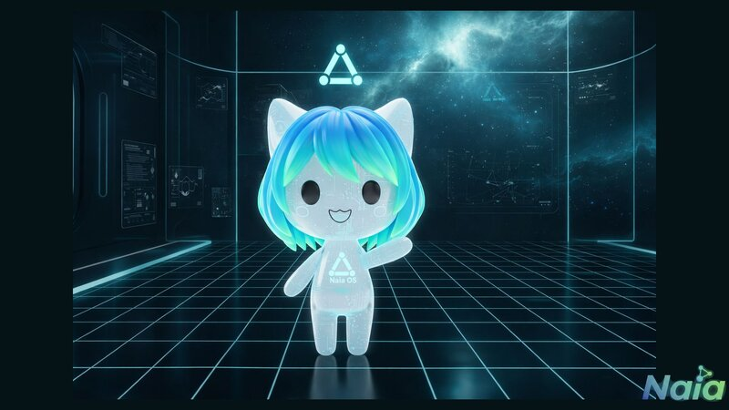
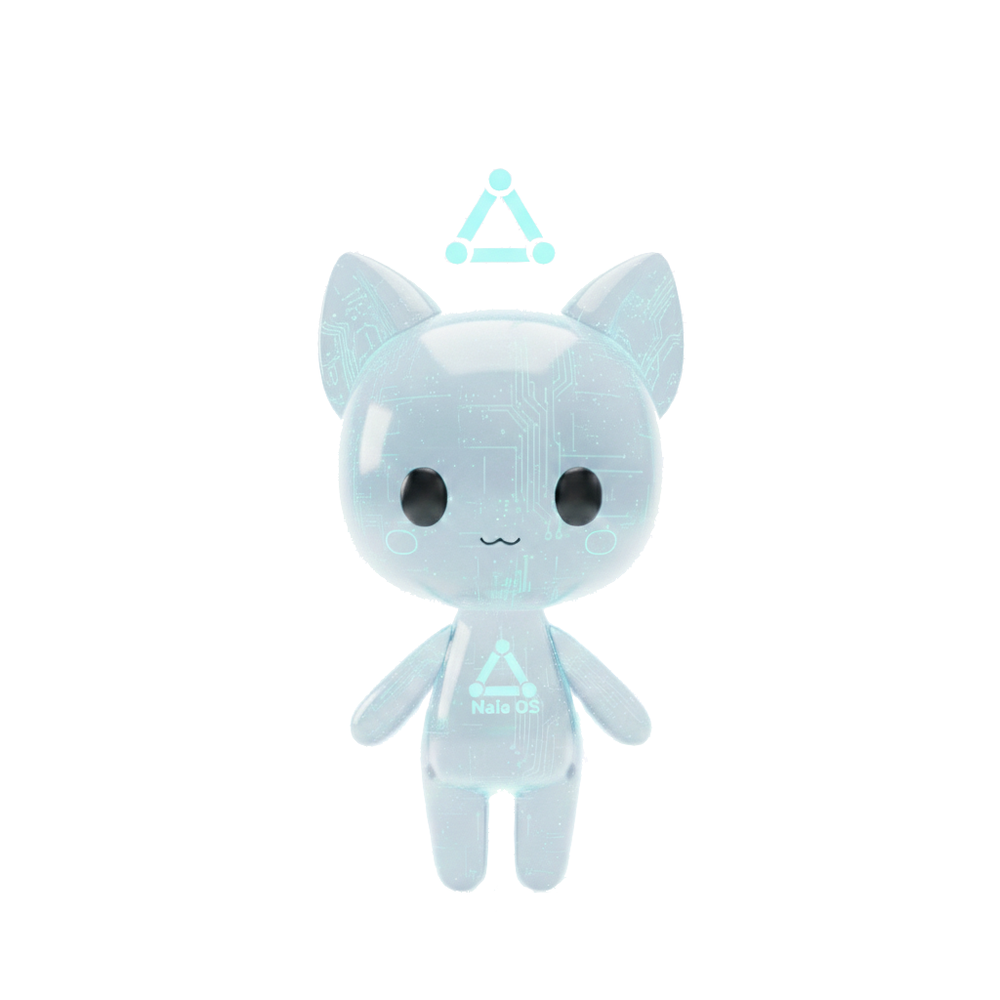
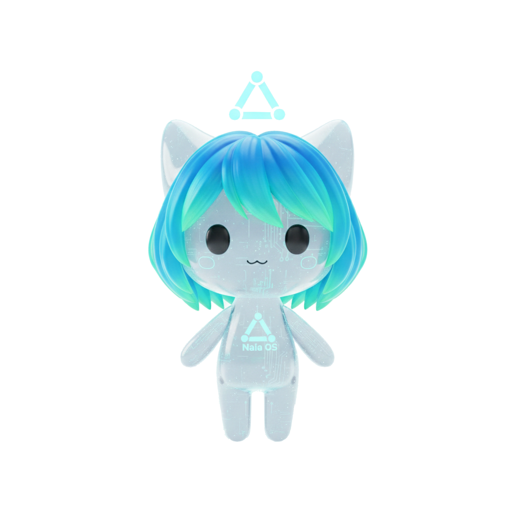
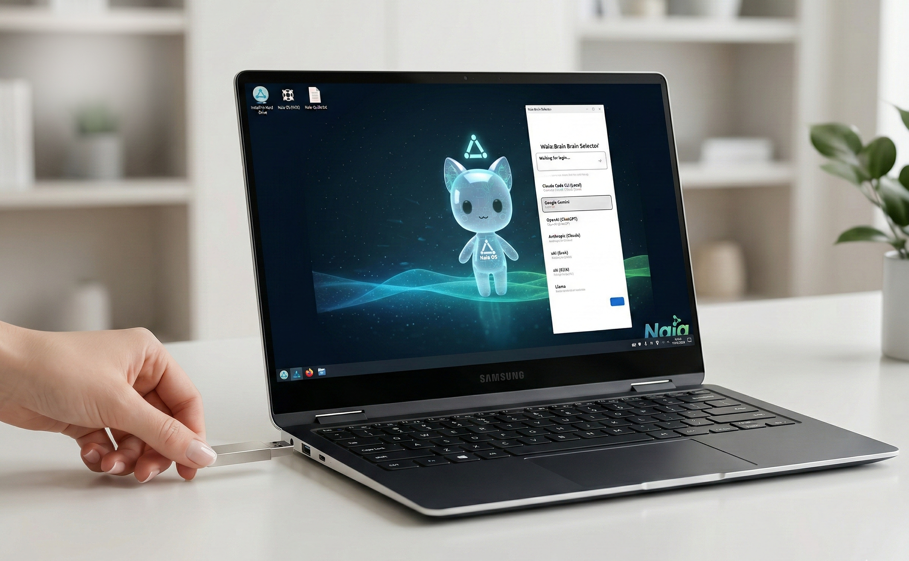

[English](../README.md) | [한국어](README.ko.md) | [日本語](README.ja.md) | [中文](README.zh.md) | [Français](README.fr.md) | [Deutsch](README.de.md) | [Русский](README.ru.md) | [Español](README.es.md) | [Português](README.pt.md) | [Tiếng Việt](README.vi.md) | [Bahasa Indonesia](README.id.md) | [العربية](README.ar.md) | [हिन्दी](README.hi.md) | [বাংলা](README.bn.md)

# Naia

<p align="center">
  
</p>

**The Next Generation AI OS** — Персональная операционная система ИИ, где живёт ваш собственный ИИ

**AI-Native Open Source** — Вносите вклад на любом языке. ИИ связывает всё общение. [→ Как это работает](#ai-native-open-source)

[](../LICENSE)

> «Открытый исходный код. Ваш ИИ, ваши правила. Выбирайте ИИ, формируйте его память и личность, дайте ему голос — всё на вашей машине, всё проверяемо в коде.»

> **Примечание:** Показанные образцы VRM-аватаров взяты с [VRoid Hub](https://hub.vroid.com/). Официальный VRM-маскот Naia в разработке.

## Познакомьтесь с Naia

<p align="center">
  
  &nbsp;&nbsp;&nbsp;&nbsp;
  
</p>

<p align="center">
  <em>По умолчанию (бесполый) &nbsp;·&nbsp; С волосами (женский вариант)</em>
</p>

<details>
<summary>Больше вариаций персонажа</summary>
<p align="center">
  
</p>
</details>

## Вставьте USB — ИИ запустится мгновенно

<p align="center">
  
</p>

<p align="center">
  <strong>Без установки, без настройки.</strong><br/>
  Просто вставьте USB Naia OS в любой ноутбук и включите — ваш собственный ИИ мгновенно оживёт.<br/>
  Попробуйте, и установите на жёсткий диск, если понравится.
</p>

## Что такое Naia?

Naia — это персональная ИИ-ОС, которая даёт вам полный контроль над вашим ИИ. Выбирайте, какой ИИ использовать (включая локальные модели), настраивайте его память и личность локально, кастомизируйте 3D-аватар и голос — всё остаётся на вашей машине, под вашим управлением.

Это не просто ещё один ИИ-инструмент. Это операционная система, в которой ваш ИИ живёт, растёт и работает рядом с вами. Сегодня это десктопная ОС с 3D-аватаром. Завтра — видео-аватары в реальном времени, пение, игры и, в конечном итоге, ваш собственный Physical AI (ОС для андроида).

### Основная философия

- **Суверенитет ИИ** — Вы выбираете ИИ. Облачный или локальный. ОС не диктует.
- **Полный контроль** — Память, личность, настройки — всё хранится локально. Без зависимости от облака.
- **Ваш собственный ИИ** — Настраивайте аватар, голос, имя, личность. Сделайте его по-настоящему своим.
- **Всегда на связи** — ИИ работает 24/7 в фоновом режиме, получает сообщения и выполняет задачи, даже когда вас нет.
- **Открытый исходный код** — Apache 2.0. Проверяйте, как ИИ обрабатывает ваши данные. Изменяйте, настраивайте, вносите вклад.
- **Видение будущего** — VRM 3D-аватары → видео-аватары в реальном времени → совместное пение и игры → Physical AI

### Возможности

- **3D-аватар** — VRM-персонаж с выражением эмоций (радость/грусть/удивление/размышление) и синхронизацией губ
- **Свобода ИИ** — 7 облачных провайдеров (Gemini, Claude, GPT, Grok, zAI) + локальный ИИ (Ollama) + Claude Code CLI
- **Локальность прежде всего** — Память, личность, все настройки хранятся на вашей машине
- **Выполнение инструментов** — 8 инструментов: чтение/запись файлов, терминал, веб-поиск, браузер, суб-агент
- **70+ навыков** — 7 встроенных + 63 пользовательских + 5 700+ навыков сообщества ClawHub
- **Голос** — 5 TTS-провайдеров + STT + синхронизация губ. Дайте ИИ тот голос, который хотите.
- **14 языков** — Корейский, английский, японский, китайский, французский, немецкий, русский и другие
- **Всегда включён** — Демон OpenClaw Gateway поддерживает работу ИИ в фоновом режиме
- **Интеграция каналов** — Общайтесь с ИИ через Discord DM в любое время, откуда угодно
- **4-уровневая безопасность** — От T0 (чтение) до T3 (опасно), одобрение по инструментам, журналы аудита
- **Персонализация** — Имя, личность, стиль речи, аватар, тема (8 типов)

## Почему Naia?

Другие ИИ-инструменты — это просто «инструменты». Naia — это **«ваш собственный ИИ»**.

| | Другие ИИ-инструменты | Naia |
|---|----------------------|------|
| **Философия** | ИИ как инструмент | Отдать ИИ ОС. Жить вместе. |
| **Аудитория** | Только разработчики | Все, кто хочет своего ИИ |
| **Выбор ИИ** | Платформа решает | 7 облачных + локальный ИИ — вы решаете |
| **Данные** | Заперты в облаке | Память, личность, настройки — всё локально |
| **Аватар** | Нет | VRM 3D-персонаж + эмоции + синхронизация губ |
| **Голос** | Только текст или базовый TTS | 5 TTS + STT + собственный голос ИИ |
| **Развёртывание** | npm / brew / pip | Десктопное приложение или загрузочная USB-ОС |
| **Платформа** | macOS / CLI / Web | Нативный Linux-десктоп → в будущем: Physical AI |
| **Стоимость** | Нужны отдельные API-ключи | Бесплатные кредиты для старта, локальный ИИ полностью бесплатен |

## Связь с OpenClaw

Naia построен поверх экосистемы [OpenClaw](https://github.com/openclaw-ai/openclaw), но это принципиально другой продукт.

| | OpenClaw | Naia |
|---|---------|---------|
| **Форма** | CLI-демон + терминал | Десктопное приложение + 3D-аватар |
| **Аудитория** | Разработчики | Все |
| **UI** | Нет (терминал) | Нативное приложение Tauri 2 (React + Three.js) |
| **Аватар** | Нет | VRM 3D-персонаж (эмоции, синхронизация губ, взгляд) |
| **LLM** | Один провайдер | Мульти-провайдер 7 + переключение в реальном времени |
| **Голос** | TTS 3 (Edge, OpenAI, ElevenLabs) | TTS 5 (+Google, Nextain) + STT + синхронизация губ аватара |
| **Эмоции** | Нет | 6 эмоций, отображаемых на выражения лица |
| **Онбординг** | CUI | GUI + выбор VRM-аватара |
| **Отслеживание расходов** | Нет | Панель кредитов в реальном времени |
| **Распространение** | npm install | Flatpak / AppImage / DEB / RPM + образ ОС |
| **Многоязычность** | Английский CLI | 14-языковый GUI |
| **Каналы** | Серверный бот (мультиканал) | Выделенный Discord DM-бот Naia |

**Что мы взяли из OpenClaw:** Архитектура демона, движок выполнения инструментов, система каналов, экосистема навыков (совместимость с 5 700+ навыками Clawhub)

**Что Naia построил заново:** Tauri Shell, система VRM-аватаров, мульти-LLM агент, движок эмоций, интеграция TTS/STT, мастер онбординга, отслеживание расходов, интеграция аккаунта Nextain, система памяти (STM/LTM), уровни безопасности

## Архитектура

```
┌──────────────────────────────────────────────────┐
│  Naia Shell (Tauri 2 + React + Three.js)         │
│  Chat · Avatar · Skills · Channels · Settings    │
│  State: Zustand │ DB: SQLite │ Auth: OAuth        │
└──────────────┬───────────────────────────────────┘
               │ stdio JSON lines
┌──────────────▼───────────────────────────────────┐
│  Naia Agent (Node.js + TypeScript)               │
│  LLM: Gemini, Claude, GPT, Grok, zAI, Ollama    │
│  TTS: Nextain, Edge, Google, OpenAI, ElevenLabs  │
│  Skills: 7 built-in + 63 custom                  │
└──────────────┬───────────────────────────────────┘
               │ WebSocket (ws://127.0.0.1:18789)
┌──────────────▼───────────────────────────────────┐
│  OpenClaw Gateway (systemd user daemon)          │
│  88 RPC methods │ Tool exec │ Channels │ Memory  │
└──────────────────────────────────────────────────┘
```

**Слияние 3 проектов:**
- **OpenClaw** — Демон + выполнение инструментов + каналы + экосистема навыков
- **Careti** — Мульти-LLM + протокол инструментов + коммуникация stdio
- **OpenCode** — Паттерн разделения клиент/сервер

## Структура проекта

```
naia-os/
├── shell/              # Десктопное приложение Tauri 2 (React + Rust)
│   ├── src/            #   React-компоненты + управление состоянием
│   ├── src-tauri/      #   Rust-бэкенд (управление процессами, SQLite, аутентификация)
│   └── e2e-tauri/      #   WebDriver E2E-тесты
├── agent/              # Ядро ИИ-агента Node.js
│   ├── src/providers/  #   LLM-провайдеры (Gemini, Claude, GPT и т.д.)
│   ├── src/tts/        #   TTS-провайдеры (Edge, Google, OpenAI и т.д.)
│   ├── src/skills/     #   Встроенные навыки (13 специфичных для Naia TypeScript)
│   └── assets/         #   Комплектные навыки (64 skill.json)
├── gateway/            # Мост OpenClaw Gateway
├── flatpak/            # Flatpak-упаковка (io.nextain.naia)
├── recipes/            # Рецепты образов ОС BlueBuild
├── config/             # Конфигурация ОС (systemd, скрипты-обёртки)
├── .agents/            # ИИ-контекст (английский, JSON/YAML)
└── .users/             # Документация для людей (корейский, Markdown)
```

## Контекстные документы (Dual-directory Architecture)

Двойная структура документации для ИИ-агентов и разработчиков. `.agents/` содержит токен-эффективный JSON/YAML для ИИ, `.users/` содержит корейский Markdown для людей.

| ИИ-контекст (`.agents/`) | Документы для людей (`.users/`) | Описание |
|---|---|---|
| [`context/agents-rules.json`](../.agents/context/agents-rules.json) | [`context/agents-rules.md`](../.users/context/agents-rules.md) | Правила проекта (SoT) |
| [`context/project-index.yaml`](../.agents/context/project-index.yaml) | — | Индекс контекста + правила зеркалирования |
| [`context/vision.yaml`](../.agents/context/vision.yaml) | [`context/vision.md`](../.users/context/vision.md) | Видение проекта, основные концепции |
| [`context/plan.yaml`](../.agents/context/plan.yaml) | [`context/plan.md`](../.users/context/plan.md) | План реализации, статус по фазам |
| [`context/architecture.yaml`](../.agents/context/architecture.yaml) | [`context/architecture.md`](../.users/context/architecture.md) | Гибридная архитектура, уровни безопасности |
| [`context/openclaw-sync.yaml`](../.agents/context/openclaw-sync.yaml) | [`context/openclaw-sync.md`](../.users/context/openclaw-sync.md) | Синхронизация OpenClaw Gateway |
| [`context/channels-discord.yaml`](../.agents/context/channels-discord.yaml) | [`context/channels-discord.md`](../.users/context/channels-discord.md) | Архитектура интеграции Discord |
| [`context/philosophy.yaml`](../.agents/context/philosophy.yaml) | [`context/philosophy.md`](../.users/context/philosophy.md) | Core philosophy (AI sovereignty, privacy) |
| [`context/contributing.yaml`](../.agents/context/contributing.yaml) | [`context/contributing.md`](../.users/context/contributing.md) | Contribution guide for AI agents and humans |
| [`context/brand.yaml`](../.agents/context/brand.yaml) | [`context/brand.md`](../.users/context/brand.md) | Brand identity, character design, color system |
| [`context/donation.yaml`](../.agents/context/donation.yaml) | [`context/donation.md`](../.users/context/donation.md) | Donation policy and open source sustainability |
| [`workflows/development-cycle.yaml`](../.agents/workflows/development-cycle.yaml) | [`workflows/development-cycle.md`](../.users/workflows/development-cycle.md) | Цикл разработки (PLAN->BUILD->VERIFY) |

**Правило зеркалирования:** При изменении одной стороны другая всегда должна быть синхронизирована.

## Технологический стек

| Уровень | Технология | Назначение |
|---------|-----------|-----------|
| ОС | Bazzite (Fedora Atomic) | Неизменяемый Linux, GPU-драйверы |
| Сборка ОС | BlueBuild | Образы ОС на основе контейнеров |
| Десктопное приложение | Tauri 2 (Rust) | Нативная оболочка |
| Фронтенд | React 18 + TypeScript + Vite | UI |
| Аватар | Three.js + @pixiv/three-vrm | 3D VRM-рендеринг |
| Управление состоянием | Zustand | Клиентское состояние |
| LLM-движок | Node.js + мульти SDK | Ядро агента |
| Протокол | stdio JSON lines | Коммуникация Shell <-> Agent |
| Шлюз | OpenClaw | Демон + RPC-сервер |
| БД | SQLite (rusqlite) | Память, журналы аудита |
| Форматтер | Biome | Линтинг + форматирование |
| Тесты | Vitest + tauri-driver | Юнит + E2E |
| Пакеты | pnpm | Управление зависимостями |

## Быстрый старт

### Предварительные требования

- Linux (Bazzite, Ubuntu, Fedora и т.д.)
- Node.js 22+, pnpm 9+
- Rust stable (для сборки Tauri)
- Системные пакеты: `webkit2gtk4.1-devel libappindicator-gtk3-devel librsvg2-devel` (Fedora)

### Запуск разработки

```bash
# Установка зависимостей
cd shell && pnpm install
cd ../agent && pnpm install

# Запуск приложения Tauri (Gateway + Agent авто-запуск)
cd ../shell && pnpm run tauri dev
```

При запуске приложения автоматически:
1. Проверка здоровья OpenClaw Gateway → повторное использование, если работает, иначе авто-запуск
2. Запуск Agent Core (Node.js, stdio-соединение)
3. При выходе из приложения завершается только авто-запущенный Gateway

### Тесты

```bash
cd shell && pnpm test                # Юнит-тесты Shell
cd agent && pnpm test                # Юнит-тесты Agent
cd agent && pnpm exec tsc --noEmit   # Проверка типов
cargo test --manifest-path shell/src-tauri/Cargo.toml  # Тесты Rust

# E2E (требуется Gateway + API-ключ)
cd shell && pnpm run test:e2e:tauri
```

### Сборка Flatpak

```bash
flatpak install --user flathub org.freedesktop.Platform//24.08 org.freedesktop.Sdk//24.08
flatpak-builder --user --install --force-clean build-dir flatpak/io.nextain.naia.yml
flatpak run io.nextain.naia
```

## Модель безопасности

Naia применяет модель безопасности **Эшелонированная оборона (Defense in Depth)**:

| Уровень | Защита |
|---------|--------|
| ОС | Неизменяемый rootfs Bazzite + SELinux |
| Шлюз | Аутентификация устройства OpenClaw + области токенов |
| Агент | 4-уровневые разрешения (T0~T3) + блокировка по инструментам |
| Оболочка | Модальное окно одобрения пользователя + переключатель ON/OFF инструментов |
| Аудит | Журнал аудита SQLite (записываются все выполнения инструментов) |

## Система памяти

- **Кратковременная память (STM):** Разговор текущей сессии (Zustand + SQLite)
- **Долговременная память (LTM):** Сводки сессий (сгенерированные LLM) + автоматическое извлечение фактов/предпочтений пользователя
- **Навык заметок:** Явное сохранение/получение заметок через `skill_memo`

## Текущий статус

| Фаза | Описание | Статус |
|------|---------|--------|
| 0 | Пайплайн развёртывания (BlueBuild -> ISO) | ✅ Завершено |
| 1 | Интеграция аватара (VRM 3D-рендеринг) | ✅ Завершено |
| 2 | Диалог (текст/голос + синхронизация губ + эмоции) | ✅ Завершено |
| 3 | Выполнение инструментов (8 инструментов + разрешения + аудит) | ✅ Завершено |
| 4 | Постоянный демон (Gateway + Skills + Память + Discord) | ✅ Завершено |
| 5 | Интеграция аккаунта Nextain (OAuth + кредиты + LLM-прокси) | ✅ Завершено |
| 6 | Распространение Tauri-приложения (Flatpak/DEB/RPM/AppImage) | ✅ Завершено |
| 7 | ISO-образ ОС (загрузка с USB -> установка -> ИИ ОС) | ✅ Завершено |

## Скачать

| Формат | Ссылка | Описание |
|--------|--------|----------|
| **Naia OS (ISO)** | [Скачать (~7,2 ГБ)](https://pub-affd0538517845d98ce44a5aec11dd98.r2.dev/naia-os-live-amd64.iso) | Полная ИИ ОС — загрузка с USB, установка на жёсткий диск |
| Flatpak | [GitHub Release](https://github.com/nextain/naia-os/releases/latest/download/Naia-Shell-x86_64.flatpak) | Только приложение Naia Shell (для существующего Linux) |
| AppImage | [GitHub Release](https://github.com/nextain/naia-os/releases/latest/download/Naia-Shell-x86_64.AppImage) | Портативное приложение (без установки) |
| DEB / RPM | [Все релизы](https://github.com/nextain/naia-os/releases) | Для Debian/Ubuntu или Fedora/openSUSE |

Подробности и контрольные суммы см. на [naia.nextain.io/download](https://naia.nextain.io/ru/download).

## Обновления ОС

Naia OS построен на [Bazzite](https://github.com/ublue-os/bazzite) (Fedora Atomic). Обновления **атомарные и безопасные**:

- **Автоматические**: Еженедельная пересборка подхватывает последние патчи безопасности и обновления Bazzite
- **Атомарные**: Новый образ разворачивается рядом с текущим — при сбое старый образ остаётся нетронутым
- **Откат**: Выберите предыдущую версию в меню GRUB для мгновенного восстановления
- **Наш оверлей**: Добавляет только пакеты (fcitx5, шрифты) + Naia Shell (Flatpak, в песочнице) + конфигурации брендинга — никогда не затрагивает ядро, загрузчик или ядро systemd

```
Обновление базы Bazzite → Еженедельная авто-пересборка → Smoke-тест контейнера → Пересборка ISO → Загрузка на R2
                                                                                ↘ Push в GHCR → bootc-обновление пользователя
```

## Процесс разработки

### Разработка функций (по умолчанию) — Issue-Driven Development

```
ISSUE → UNDERSTAND → SCOPE → INVESTIGATE → PLAN → BUILD → REVIEW → E2E → SYNC → COMMIT
```

- **3 обязательных шлюза** — Подтверждение пользователя требуется на этапах UNDERSTAND, SCOPE и PLAN
- **После утверждения плана** — ИИ выполняет от BUILD до COMMIT непрерывно без остановок
- **Принципы** — Сначала читать upstream-код (без догадок). Минимальные изменения. Никогда не ломать рабочий код.
- **Коммиты** — Английский, `<type>(<scope>): <description>`
- **Форматтер** — Biome (табуляция, двойные кавычки, точки с запятой)

## Справочные проекты

| Проект | Что мы берём |
|--------|-------------|
| [Bazzite](https://github.com/ublue-os/bazzite) | Неизменяемая ОС Linux, GPU, оптимизация для игр |
| [OpenClaw](https://github.com/steipete/openclaw) | Демон Gateway, интеграция каналов, Skills |
| [Project AIRI](https://github.com/moeru-ai/airi) | VRM Avatar, протокол плагинов (вдохновлён Neuro-sama) |
| [OpenCode](https://github.com/anomalyco/opencode) | Разделение клиент/сервер, абстракция провайдеров |
| [Careti](https://github.com/caretive-ai/careti) | Подключение LLM, набор инструментов, суб-агент, управление контекстом |
| [Neuro-sama](https://vedal.ai/) | Вдохновение AI VTuber — ИИ-персонаж с личностью, стриминг, взаимодействие с аудиторией |

Naia существует благодаря этим проектам. Мы глубоко благодарны всем мейнтейнерам и сообществам открытого исходного кода, которые создали фундамент, на котором мы стоим.

## AI-Native Open Source

Большинство проектов с открытым исходным кодом в 2025–2026 годах защищаются от AI-вклада. **Naia идёт противоположным путём**: проект спроектирован так, чтобы вклады с помощью ИИ были высококачественными по умолчанию.

> **«Проектировать С ИИ, а не защищаться ОТ ИИ.»**

### Как это работает

```
Человек (любой язык) → ИИ → Git (английский) → ИИ → Человек (любой язык)
```

- **Пишите issues и PR на своём языке** — ИИ переведёт всё
- **И контрибьюторы, и мейнтейнеры используют ИИ** — кодинг, ревью, триаж
- **Богатый контекст `.agents/`** позволяет ИИ глубоко понимать проект — чем лучше ИИ понимает, тем выше качество вклада
- **10 типов вклада** — перевод, навыки, фичи, баги, код, документация, тесты, дизайн, безопасность, контекст
- **Рабочие записи на родном языке** — ведите приватный репозиторий на своём языке; просматривайте Git-историю через ИИ-перевод

Это не просто политика. Это архитектура. Каталог `.agents/`, тройное зеркалирование документации и правила защиты лицензий — всё спроектировано так, чтобы AI-сотрудничество было структурным, а не случайным.

Полная модель: [`open-source-operations.yaml`](../.agents/context/open-source-operations.yaml) | [Отчёт (EN)](../docs/reports/20260307-ai-native-opensource-operations.md) | [Отчёт (KO)](../docs/reports/20260307-ai-native-opensource-operations-ko.md)

## Лицензия

- **Исходный код**: [Apache License 2.0](../LICENSE) — Copyright 2026 Nextain
- **ИИ-контекст** (`.agents/`, `.users/`, `AGENTS.md`): [CC-BY-SA 4.0](https://creativecommons.org/licenses/by-sa/4.0/)

## Ссылки

- **Официальный сайт:** [naia.nextain.io](https://naia.nextain.io)
- **Руководство:** [naia.nextain.io/ru/manual](https://naia.nextain.io/ru/manual)
- **Панель управления:** [naia.nextain.io/ru/dashboard](https://naia.nextain.io/ru/dashboard)
