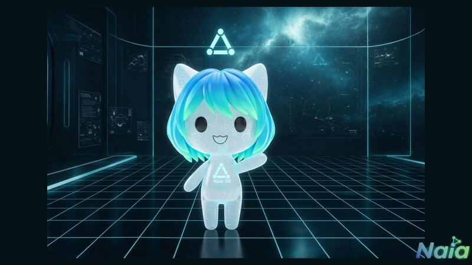

[English](../README.md) | [한국어](README.ko.md) | [日本語](README.ja.md) | [中文](README.zh.md) | [Français](README.fr.md) | [Deutsch](README.de.md) | [Русский](README.ru.md) | [Español](README.es.md) | [Português](README.pt.md) | [Tiếng Việt](README.vi.md) | [Bahasa Indonesia](README.id.md) | [العربية](README.ar.md) | [हिन्दी](README.hi.md) | [বাংলা](README.bn.md)

# Naia

<p align="center">
  
</p>

**The Next Generation AI OS** — He dieu hanh AI ca nhan noi AI cua ban sinh song

[](../LICENSE)

> "Ma nguon mo. AI cua ban, quy tac cua ban. Chon AI, dinh hinh tri nho va tinh cach cua no, cho no giong noi — tat ca tren may tinh cua ban, tat ca co the xac minh trong ma nguon."

> **Luu y:** Cac mau avatar VRM duoc hien thi la tu [VRoid Hub](https://hub.vroid.com/). VRM linh vat chinh thuc cua Naia dang duoc phat trien.

## Gap go Naia

<p align="center">
  
  &nbsp;&nbsp;&nbsp;&nbsp;
  
</p>

<p align="center">
  <em>Mac dinh (khong gioi tinh) &nbsp;·&nbsp; Co toc (phien ban nu)</em>
</p>

<details>
<summary>Them cac bien the nhan vat</summary>
<p align="center">
  
</p>
</details>

## Naia la gi?

Naia la mot he dieu hanh AI ca nhan mang lai quyen tu chu hoan toan ve AI cho moi ca nhan. Chon AI nao de su dung (bao gom ca mo hinh cuc bo), cau hinh tri nho va tinh cach cuc bo, tuy chinh avatar 3D va giong noi — moi thu deu o tren may tinh cua ban, duoi su kiem soat cua ban.

Day khong chi la mot cong cu AI khac. Day la he dieu hanh noi AI cua ban sinh song, truong thanh va lam viec ben canh ban. Hom nay la he dieu hanh desktop voi avatar 3D. Ngay mai — avatar video thoi gian thuc, hat, choi game, va cuoi cung la Physical AI cua rieng ban (he dieu hanh android).

### Triet ly cot loi

- **Chu quyen AI** — Ban chon AI. Dam may hay cuc bo. He dieu hanh khong ap dat.
- **Kiem soat hoan toan** — Tri nho, tinh cach, cai dat — tat ca luu tru cuc bo. Khong phu thuoc dam may.
- **AI cua rieng ban** — Tuy chinh avatar, giong noi, ten, tinh cach. Bien no thanh cua ban.
- **Luon hoat dong** — AI chay 24/7 trong nen, nhan tin nhan va lam viec ngay ca khi ban vang mat.
- **Ma nguon mo** — Apache 2.0. Kiem tra cach AI xu ly du lieu cua ban. Tu do chinh sua, tuy bien, dong gop.
- **Tam nhin tuong lai** — Avatar VRM 3D → avatar video thoi gian thuc → hat va choi game cung nhau → Physical AI

### Tinh nang

- **Avatar 3D** — Nhan vat VRM voi bieu cam cam xuc (vui/buon/ngac nhien/suy nghi) va dong bo moi
- **Tu do AI** — 7 nha cung cap dam may (Gemini, Claude, GPT, Grok, zAI) + AI cuc bo (Ollama) + Claude Code CLI
- **Cuc bo la uu tien** — Tri nho, tinh cach, tat ca cai dat luu tren may tinh cua ban
- **Thuc thi cong cu** — 8 cong cu: doc/ghi tep, terminal, tim kiem web, trinh duyet, sub-agent
- **70+ ky nang** — 7 tich hop san + 63 tuy chinh + 5.700+ ky nang cong dong ClawHub
- **Giong noi** — 5 nha cung cap TTS + STT + dong bo moi. Cho AI giong noi ban muon.
- **14 ngon ngu** — Tieng Han, Tieng Anh, Tieng Nhat, Tieng Trung, Tieng Phap, Tieng Duc, Tieng Nga va nhieu hon
- **Luon bat** — Daemon OpenClaw Gateway giu AI chay trong nen
- **Tich hop kenh** — Noi chuyen voi AI qua Discord DM, bat cu luc nao, bat cu noi dau
- **Bao mat 4 cap** — T0 (doc) den T3 (nguy hiem), phe duyet theo cong cu, nhat ky kiem toan
- **Ca nhan hoa** — Ten, tinh cach, phong cach noi, avatar, chu de (8 loai)

## Tai sao chon Naia?

Cac cong cu AI khac chi la "cong cu". Naia la **"AI cua rieng ban"**.

| | Cac cong cu AI khac | Naia |
|---|---------------------|------|
| **Triet ly** | Su dung AI nhu cong cu | Trao AI he dieu hanh. Song cung nhau. |
| **Doi tuong** | Chi lap trinh vien | Tat ca nhung ai muon AI cua rieng minh |
| **Chon AI** | Nen tang quyet dinh | 7 dam may + AI cuc bo — ban quyet dinh |
| **Du lieu** | Bi khoa tren dam may | Tri nho, tinh cach, cai dat tat ca cuc bo |
| **Avatar** | Khong co | Nhan vat VRM 3D + cam xuc + dong bo moi |
| **Giong noi** | Chi van ban hoac TTS co ban | 5 TTS + STT + giong noi rieng cua AI |
| **Trien khai** | npm / brew / pip | Ung dung desktop hoac he dieu hanh USB khoi dong |
| **Nen tang** | macOS / CLI / Web | Desktop Linux native → tuong lai: Physical AI |
| **Chi phi** | Can khoa API rieng | Tin dung mien phi de bat dau, AI cuc bo hoan toan mien phi |

## Moi quan he voi OpenClaw

Naia duoc xay dung tren he sinh thai [OpenClaw](https://github.com/openclaw-ai/openclaw), nhung la mot san pham khac biet ve ban chat.

| | OpenClaw | Naia |
|---|---------|---------|
| **Hinh thuc** | Daemon CLI + terminal | Ung dung desktop + avatar 3D |
| **Doi tuong** | Lap trinh vien | Tat ca moi nguoi |
| **UI** | Khong co (terminal) | Ung dung native Tauri 2 (React + Three.js) |
| **Avatar** | Khong co | Nhan vat VRM 3D (cam xuc, dong bo moi, anh mat) |
| **LLM** | Nha cung cap don | Da nha cung cap 7 + chuyen doi thoi gian thuc |
| **Giong noi** | TTS 3 (Edge, OpenAI, ElevenLabs) | TTS 5 (+Google, Nextain) + STT + dong bo moi avatar |
| **Cam xuc** | Khong co | 6 cam xuc anh xa vao bieu cam khuon mat |
| **Onboarding** | CUI | GUI + chon avatar VRM |
| **Theo doi chi phi** | Khong co | Bang dieu khien tin dung thoi gian thuc |
| **Phan phoi** | npm install | Flatpak / AppImage / DEB / RPM + anh he dieu hanh |
| **Da ngon ngu** | CLI tieng Anh | GUI 14 ngon ngu |
| **Kenh** | Bot may chu (da kenh) | Bot Discord DM danh rieng cho Naia |

**Nhung gi chung toi lay tu OpenClaw:** Kien truc daemon, dong co thuc thi cong cu, he thong kenh, he sinh thai ky nang (tuong thich 5.700+ ky nang Clawhub)

**Nhung gi Naia xay dung moi:** Tauri Shell, he thong avatar VRM, agent da LLM, dong co cam xuc, tich hop TTS/STT, tro ly onboarding, theo doi chi phi, tich hop tai khoan Nextain, he thong bo nho (STM/LTM), cac lop bao mat

## Kien truc

```
┌──────────────────────────────────────────────────┐
│  Naia Shell (Tauri 2 + React + Three.js)         │
│  Chat · Avatar · Skills · Channels · Settings    │
│  State: Zustand │ DB: SQLite │ Auth: OAuth        │
└──────────────┬───────────────────────────────────┘
               │ stdio JSON lines
┌──────────────▼───────────────────────────────────┐
│  Naia Agent (Node.js + TypeScript)               │
│  LLM: Gemini, Claude, GPT, Grok, zAI, Ollama    │
│  TTS: Nextain, Edge, Google, OpenAI, ElevenLabs  │
│  Skills: 7 built-in + 63 custom                  │
└──────────────┬───────────────────────────────────┘
               │ WebSocket (ws://127.0.0.1:18789)
┌──────────────▼───────────────────────────────────┐
│  OpenClaw Gateway (systemd user daemon)          │
│  88 RPC methods │ Tool exec │ Channels │ Memory  │
└──────────────────────────────────────────────────┘
```

**Su ket hop cua 3 du an:**
- **OpenClaw** — Daemon + thuc thi cong cu + kenh + he sinh thai ky nang
- **Careti** — Da LLM + giao thuc cong cu + giao tiep stdio
- **OpenCode** — Mo hinh tach biet client/server

## Cau truc du an

```
naia-os/
├── shell/              # Ung dung desktop Tauri 2 (React + Rust)
│   ├── src/            #   Cac component React + quan ly trang thai
│   ├── src-tauri/      #   Backend Rust (quan ly tien trinh, SQLite, xac thuc)
│   └── e2e-tauri/      #   Kiem thu E2E WebDriver
├── agent/              # Loi agent AI Node.js
│   ├── src/providers/  #   Nha cung cap LLM (Gemini, Claude, GPT, v.v.)
│   ├── src/tts/        #   Nha cung cap TTS (Edge, Google, OpenAI, v.v.)
│   ├── src/skills/     #   Ky nang tich hop (13 TypeScript danh rieng cho Naia)
│   └── assets/         #   Ky nang dinh kem (64 skill.json)
├── gateway/            # Cau noi OpenClaw Gateway
├── flatpak/            # Dong goi Flatpak (io.nextain.naia)
├── recipes/            # Cong thuc anh he dieu hanh BlueBuild
├── config/             # Cau hinh he dieu hanh (systemd, script wrapper)
├── .agents/            # Ngu canh AI (tieng Anh, JSON/YAML)
└── .users/             # Tai lieu cho nguoi dung (tieng Han, Markdown)
```

## Tai lieu ngu canh (Dual-directory Architecture)

Cau truc tai lieu kep danh cho cac agent AI va lap trinh vien. `.agents/` chua JSON/YAML toi uu token cho AI, `.users/` chua Markdown tieng Han cho con nguoi.

| Ngu canh AI (`.agents/`) | Tai lieu nguoi dung (`.users/`) | Mo ta |
|---|---|---|
| [`context/agents-rules.json`](../.agents/context/agents-rules.json) | [`context/agents-rules.md`](../.users/context/en/agents-rules.md) | Quy tac du an (SoT) |
| [`context/project-index.yaml`](../.agents/context/project-index.yaml) | — | Chi muc ngu canh + quy tac phan chieu |
| [`context/vision.yaml`](../.agents/context/vision.yaml) | [`context/vision.md`](../.users/context/en/vision.md) | Tam nhin du an, khai niem cot loi |
| [`context/plan.yaml`](../.agents/context/plan.yaml) | [`context/plan.md`](../.users/context/en/plan.md) | Ke hoach trien khai, trang thai theo giai doan |
| [`context/architecture.yaml`](../.agents/context/architecture.yaml) | [`context/architecture.md`](../.users/context/en/architecture.md) | Kien truc lai, cac lop bao mat |
| [`context/openclaw-sync.yaml`](../.agents/context/openclaw-sync.yaml) | [`context/openclaw-sync.md`](../.users/context/en/openclaw-sync.md) | Dong bo OpenClaw Gateway |
| [`context/channels-discord.yaml`](../.agents/context/channels-discord.yaml) | [`context/channels-discord.md`](../.users/context/en/channels-discord.md) | Kien truc tich hop Discord |
| [`context/philosophy.yaml`](../.agents/context/philosophy.yaml) | [`context/philosophy.md`](../.users/context/en/philosophy.md) | Core philosophy (AI sovereignty, privacy) |
| [`context/contributing.yaml`](../.agents/context/contributing.yaml) | [`context/contributing.md`](../.users/context/en/contributing.md) | Contribution guide for AI agents and humans |
| [`context/brand.yaml`](../.agents/context/brand.yaml) | [`context/brand.md`](../.users/context/en/brand.md) | Brand identity, character design, color system |
| [`context/donation.yaml`](../.agents/context/donation.yaml) | [`context/donation.md`](../.users/context/en/donation.md) | Donation policy and open source sustainability |
| [`workflows/development-cycle.yaml`](../.agents/workflows/development-cycle.yaml) | [`workflows/development-cycle.md`](../.users/workflows/development-cycle.md) | Chu ky phat trien (PLAN->BUILD->VERIFY) |

**Quy tac phan chieu:** Khi mot ben duoc sua doi, ben kia phai luon duoc dong bo.

## Cong nghe su dung

| Lop | Cong nghe | Muc dich |
|-----|-----------|---------|
| He dieu hanh | Bazzite (Fedora Atomic) | Linux bat bien, driver GPU |
| Build he dieu hanh | BlueBuild | Anh he dieu hanh dua tren container |
| Ung dung desktop | Tauri 2 (Rust) | Shell native |
| Frontend | React 18 + TypeScript + Vite | UI |
| Avatar | Three.js + @pixiv/three-vrm | Render VRM 3D |
| Quan ly trang thai | Zustand | Trang thai client |
| Dong co LLM | Node.js + multi SDK | Loi agent |
| Giao thuc | stdio JSON lines | Giao tiep Shell <-> Agent |
| Gateway | OpenClaw | Daemon + may chu RPC |
| CSDL | SQLite (rusqlite) | Bo nho, nhat ky kiem toan |
| Dinh dang | Biome | Linting + formatting |
| Kiem thu | Vitest + tauri-driver | Don vi + E2E |
| Goi | pnpm | Quan ly phu thuoc |

## Bat dau nhanh

### Yeu cau tien quyet

- Linux (Bazzite, Ubuntu, Fedora, v.v.)
- Node.js 22+, pnpm 9+
- Rust stable (de build Tauri)
- Goi he thong: `webkit2gtk4.1-devel libappindicator-gtk3-devel librsvg2-devel` (Fedora)

### Chay phat trien

```bash
# Cai dat phu thuoc
cd shell && pnpm install
cd ../agent && pnpm install

# Chay ung dung Tauri (Gateway + Agent tu dong spawn)
cd ../shell && pnpm run tauri dev
```

Khi ung dung khoi dong, tu dong:
1. Kiem tra suc khoe OpenClaw Gateway → tai su dung neu dang chay, neu khong tu dong spawn
2. Spawn Agent Core (Node.js, ket noi stdio)
3. Khi thoat ung dung, chi ket thuc Gateway da tu dong spawn

### Kiem thu

```bash
cd shell && pnpm test                # Kiem thu don vi Shell
cd agent && pnpm test                # Kiem thu don vi Agent
cd agent && pnpm exec tsc --noEmit   # Kiem tra kieu
cargo test --manifest-path shell/src-tauri/Cargo.toml  # Kiem thu Rust

# E2E (can Gateway + khoa API)
cd shell && pnpm run test:e2e:tauri
```

### Build Flatpak

```bash
flatpak install --user flathub org.freedesktop.Platform//24.08 org.freedesktop.Sdk//24.08
flatpak-builder --user --install --force-clean build-dir flatpak/io.nextain.naia.yml
flatpak run io.nextain.naia
```

## Mo hinh bao mat

Naia ap dung mo hinh bao mat **Phong thu theo chieu sau (Defense in Depth)**:

| Lop | Bao ve |
|-----|--------|
| He dieu hanh | Bazzite rootfs bat bien + SELinux |
| Gateway | Xac thuc thiet bi OpenClaw + pham vi token |
| Agent | Quyen 4 cap (T0~T3) + chan theo cong cu |
| Shell | Modal phe duyet nguoi dung + chuyen doi ON/OFF cong cu |
| Kiem toan | Nhat ky kiem toan SQLite (ghi lai tat ca cac lan thuc thi cong cu) |

## He thong bo nho

- **Bo nho ngan han (STM):** Cuoc tro chuyen phien hien tai (Zustand + SQLite)
- **Bo nho dai han (LTM):** Tom tat phien (do LLM tao) + tu dong trich xuat su kien/so thich cua nguoi dung
- **Ky nang ghi chu:** Luu/truy xuat ghi chu ro rang qua `skill_memo`

## Trang thai hien tai

| Giai doan | Mo ta | Trang thai |
|-----------|-------|-----------|
| 0 | Pipeline trien khai (BlueBuild -> ISO) | ✅ Hoan thanh |
| 1 | Tich hop avatar (render VRM 3D) | ✅ Hoan thanh |
| 2 | Hoi thoai (van ban/giong noi + dong bo moi + cam xuc) | ✅ Hoan thanh |
| 3 | Thuc thi cong cu (8 cong cu + quyen + kiem toan) | ✅ Hoan thanh |
| 4 | Daemon luon bat (Gateway + Skills + Bo nho + Discord) | ✅ Hoan thanh |
| 5 | Tich hop tai khoan Nextain (OAuth + tin dung + proxy LLM) | ✅ Hoan thanh |
| 6 | Phan phoi ung dung Tauri (Flatpak/DEB/RPM/AppImage) | 🟡 Dang tien hanh |
| 7 | Anh ISO he dieu hanh (khoi dong USB -> AI OS) | ⏳ Du kien |

## Quy trinh phat trien

```
PLAN → CHECK → BUILD (TDD) → VERIFY → CLEAN → COMMIT
```

- **BUILD = TDD** — Kiem thu truoc (RED) -> trien khai toi thieu (GREEN) -> tai cau truc
- **VERIFY** — Xac nhan bang cach thuc su chay ung dung (chi kiem tra kieu la khong du)
- **Commit** — Tieng Anh, `<type>(<scope>): <description>`
- **Dinh dang** — Biome (tab, ngoac kep, dau cham phay)

## Du an tham khao

| Du an | Nhung gi chung toi lay |
|-------|----------------------|
| [Bazzite](https://github.com/ublue-os/bazzite) | He dieu hanh Linux bat bien, GPU, toi uu hoa choi game |
| [OpenClaw](https://github.com/steipete/openclaw) | Daemon Gateway, tich hop kenh, Skills |
| [Project AIRI](https://github.com/moeru-ai/airi) | Avatar VRM, giao thuc plugin |
| [OpenCode](https://github.com/anomalyco/opencode) | Tach biet client/server, truu tuong hoa provider |
| Careti | Ket noi LLM, bo cong cu, sub-agent, quan ly ngu canh |

## Giay phep

[Apache License 2.0](../LICENSE) — Copyright 2026 Nextain

## Lien ket

- **Trang web chinh thuc:** [naia.nextain.io](https://naia.nextain.io)
- **Huong dan:** [naia.nextain.io/vi/manual](https://naia.nextain.io/vi/manual)
- **Bang dieu khien:** [naia.nextain.io/vi/dashboard](https://naia.nextain.io/vi/dashboard)
