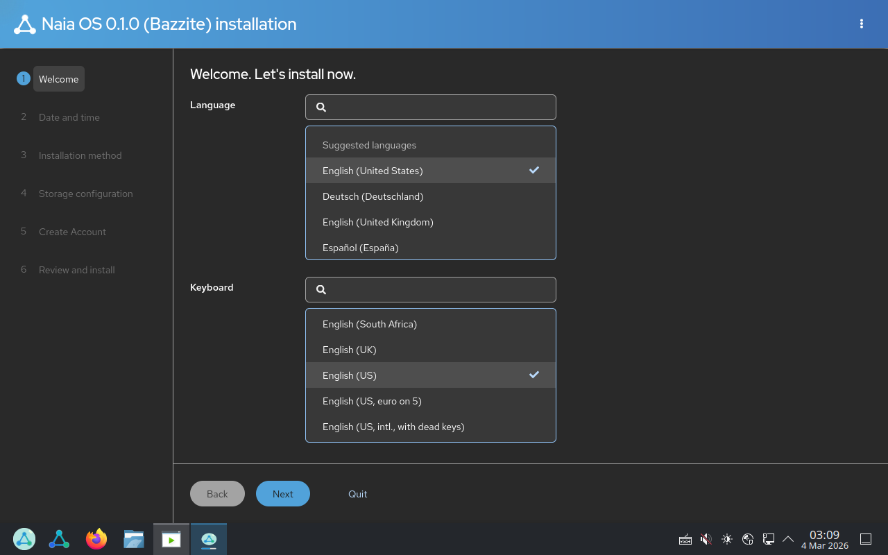
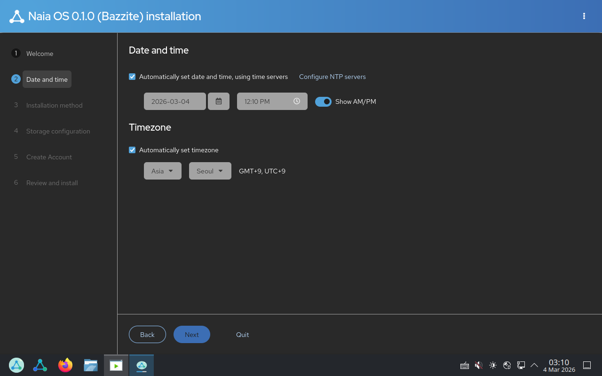
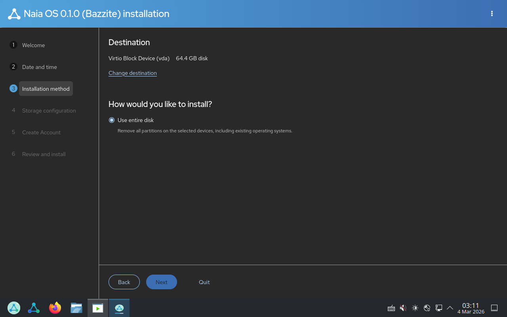
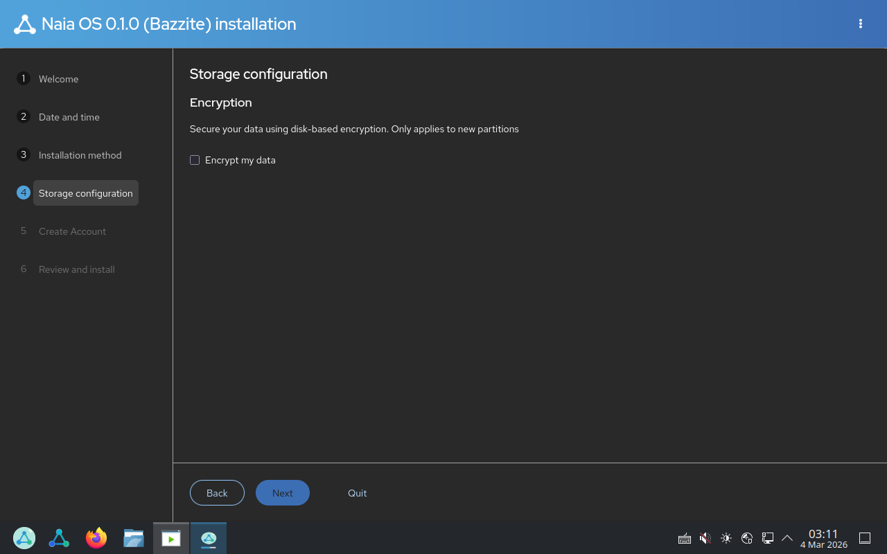
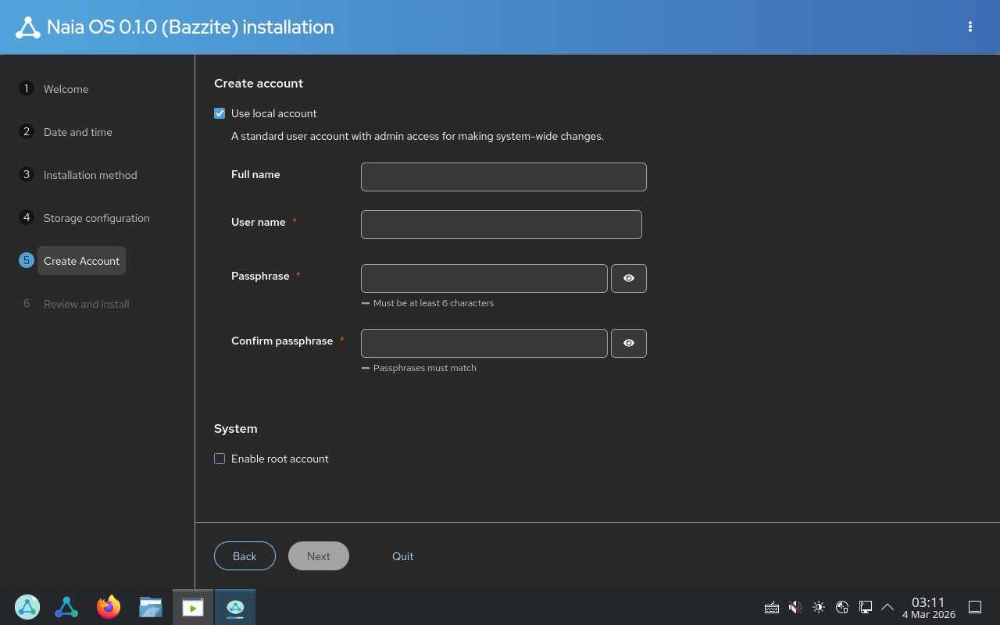
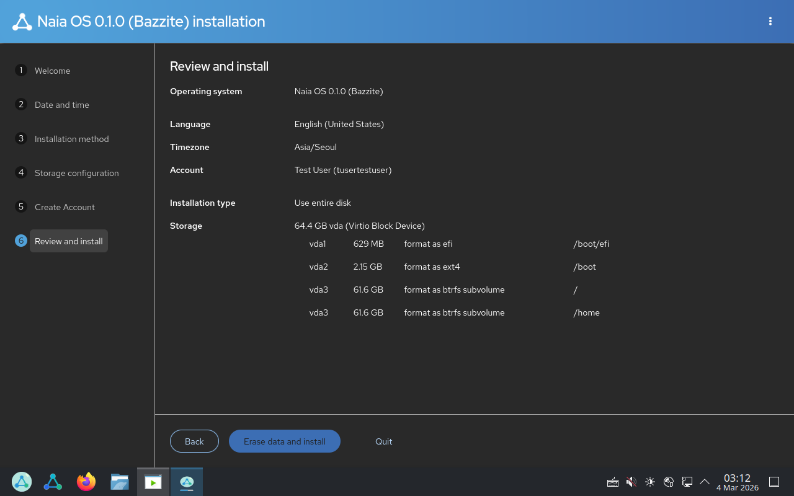
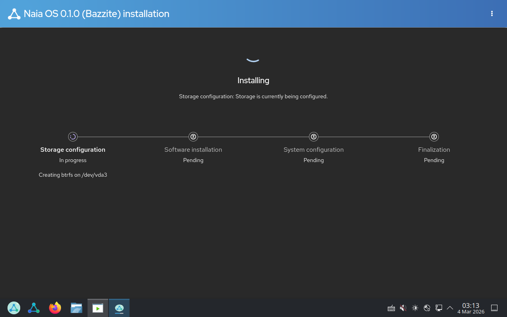
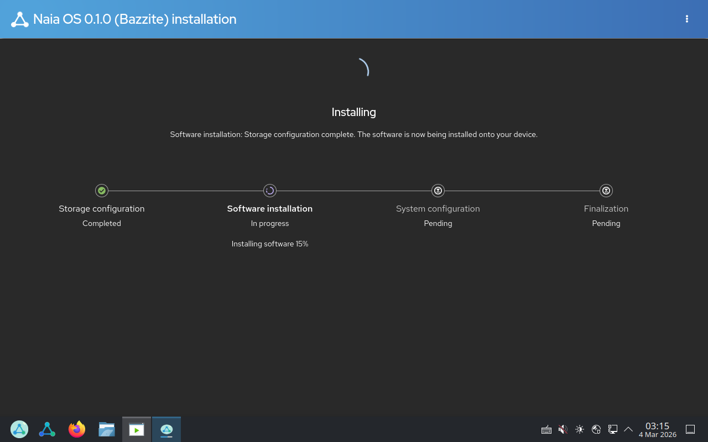

# Naia OS Installation Guide

This guide walks you through installing Naia OS from a live USB drive.

## Prerequisites

- A USB drive (8 GB or larger) flashed with the Naia OS ISO
- A computer with UEFI boot support
- At least 64 GB of free disk space
- Internet connection (recommended, for time sync)

## Boot from USB

1. Insert the Naia OS USB drive into your computer.
2. Restart and enter the BIOS/UEFI boot menu (usually `F12`, `F2`, or `Del` during startup).
3. Select the USB drive as the boot device.
4. The Naia OS live environment will load automatically.

## Launch the Installer

From the live desktop, double-click **Install to Hard Drive** or find it in the application menu.

The Anaconda installer will open in your browser with the **Naia OS 0.1.0 (Bazzite) installation** wizard.

## Step 1: Welcome — Language & Keyboard

- **Language**: Select your preferred language from the list. Use the search box to find it quickly.
- **Keyboard**: Choose your keyboard layout. English (US) is selected by default.
- Click **Next** to continue.

## Step 2: Date and Time

- **Date and time**: Automatically set using NTP time servers by default.
- **Timezone**: Detected automatically based on your location. Change the region and city if needed.
- Click **Next** to continue.

## Step 3: Installation Method

- **Destination**: Shows the detected disk (e.g., "Virtio Block Device (vda) 64.4 GB disk"). Click "Change destination" if you need to select a different drive.
- **How would you like to install?**: "Use entire disk" is the recommended option. This will erase all existing data on the selected disk.
- Click **Next** to continue.

> **Warning**: "Use entire disk" will remove all partitions and data on the selected drive. Make sure you have backed up any important data.

## Step 4: Storage Configuration

- **Encryption**: Optionally check "Encrypt my data" to enable disk encryption with LUKS. You will be prompted to set an encryption passphrase.
- For most users, leaving encryption unchecked is fine.
- Click **Next** to continue.

## Step 5: Create Account

- **Full name**: Enter your display name.
- **User name** (required): Your login username. Auto-generated from your full name.
- **Passphrase** (required): Must be at least 6 characters.
- **Confirm passphrase**: Re-enter the same passphrase.
- **Enable root account**: Leave unchecked unless you have a specific need for a root login.
- Click **Next** to continue.

## Step 6: Review and Install

Review your installation settings:

- **Operating system**: Naia OS 0.1.0 (Bazzite)
- **Language**: Your selected language
- **Timezone**: Your selected timezone
- **Account**: Your username
- **Installation type**: Use entire disk
- **Storage**: Partition layout (EFI, boot, root, home)

If everything looks correct, click **Erase data and install** to begin the installation.

## Installation Progress

The installer will proceed through four stages:

1. **Storage configuration** — Partitioning and formatting the disk
2. **Software installation** — Copying the operating system to the disk
3. **System configuration** — Setting up users, timezone, and other settings
4. **Finalization** — Final cleanup and bootloader installation

This process typically takes 10–20 minutes depending on your hardware.

## Installation Complete

Once the installation finishes, you will see a completion screen. Click **Reboot** to restart your computer.

> Remove the USB drive before the system restarts to boot from the installed disk.

## First Boot

After rebooting, Naia OS will start from your hard drive. Log in with the username and passphrase you created during installation.

Welcome to Naia OS!
